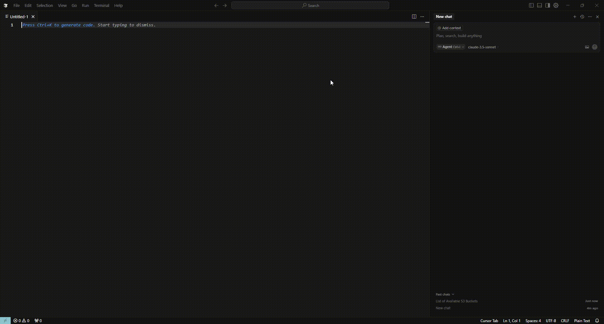
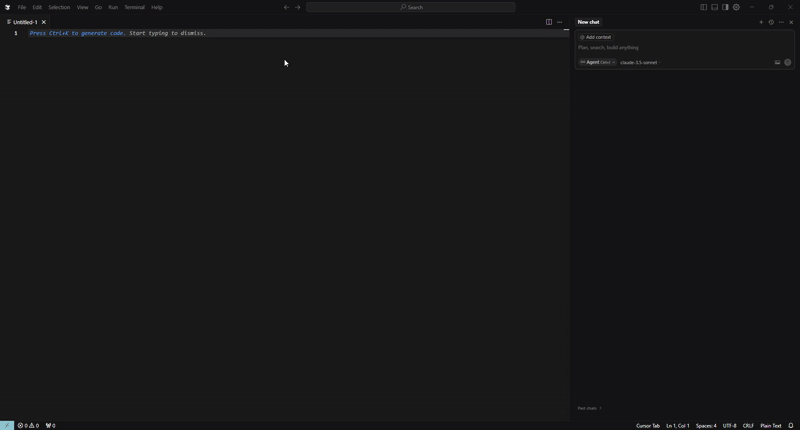
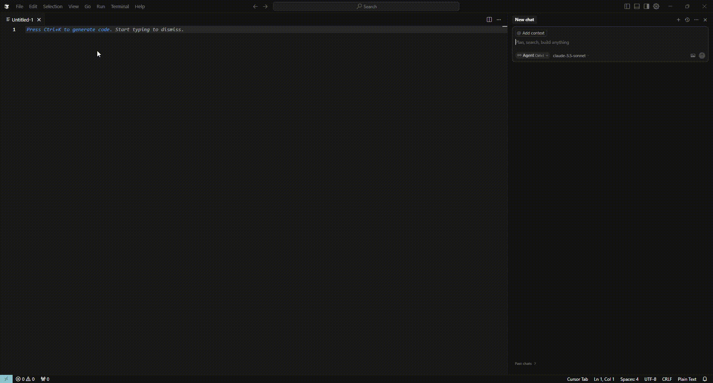
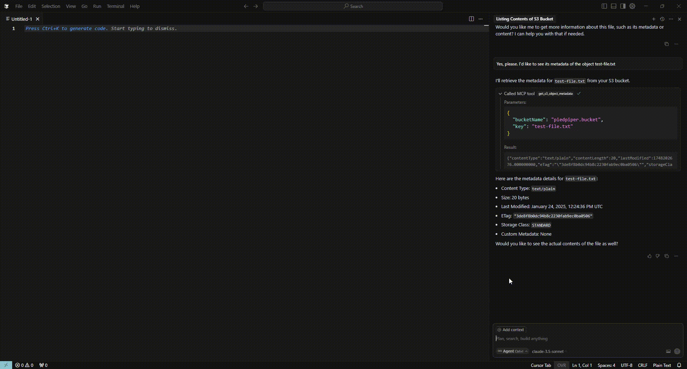
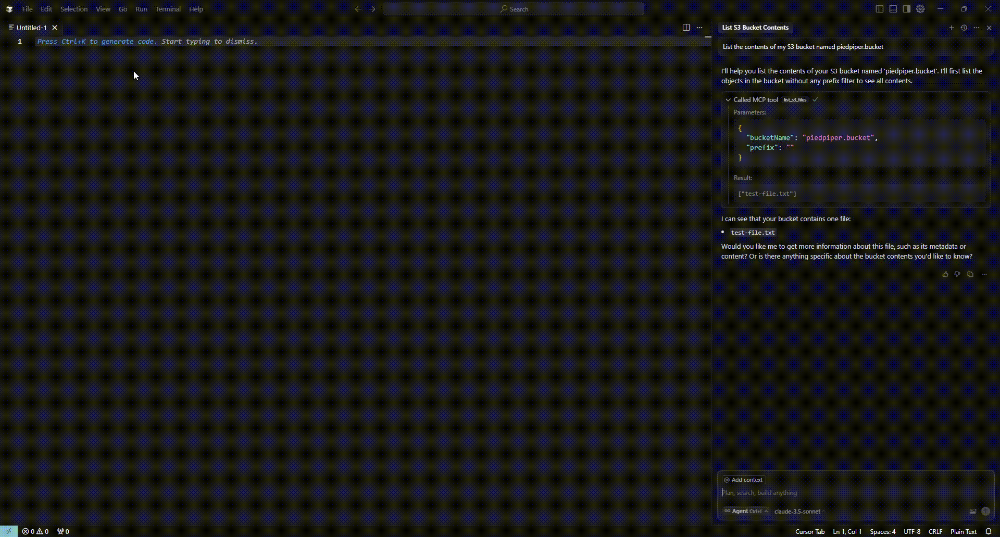

# S3 Toolbox MCP Server

A Model Context Protocol (MCP) server that makes interacting with AWS S3 buckets a breeze. Built using [Spring AI MCP](https://docs.spring.io/spring-ai/reference/api/mcp/mcp-overview.html), it uses STDIO transport for seamless communication, making it perfect for integration with modern development tools like Cursor IDE and AI agents. This server bridges the gap between your development environment and S3 operations, enabling natural language interactions for both automation tasks and interactive development.

## What it does

The S3 Toolbox MCP Server exposes core AWS S3 operations through a simple MCP interface, leveraging Spring AI's Model Context Protocol implementation. This means AI agents can naturally interact with your S3 buckets using plain language, while maintaining precise control over the operations.

### Available Tools

The server provides the following S3 operations:

- **List Buckets** (`list_s3_buckets`)
    - Lists all available S3 buckets in your account
    - No parameters needed




- **List Files** (`list_s3_files`)
    - Lists objects in a specific bucket
    - Parameters:
        - `bucketName`: Target bucket name
        - `prefix`: Optional folder path filter




- **Upload Files** (`put_s3_object`)
    - Uploads files to S3 with metadata
    - Parameters:
        - `bucketName`: Target bucket name
        - `fileName`: Name for the file in S3
        - `contentType`: MIME type (e.g., 'application/pdf', 'image/png')
        - `prefix`: Optional path prefix/folder inside the bucket
        - `base64Content`: File content encoded in Base64 format




- **Download Files** (`get_s3_object`)
    - Downloads files from S3
    - Parameters:
        - `bucketName`: Source bucket
        - `key`: File path in S3




- **Get Metadata** (`get_s3_object_metadata`)
    - Retrieves file metadata
    - Parameters:
        - `bucketName`: Target bucket
        - `key`: File path in S3




- **Delete Files** (`delete_s3_object`)
    - Removes files from S3
    - Parameters:
        - `bucketName`: Target bucket
        - `key`: File to delete


## Setup

### Prerequisites
- Java 21
- AWS credentials configured
- Maven (or use the included wrapper)

## Quick Start

1. Clone the repo:

2. Build the JAR:

Using Maven Wrapper (recommended):
```bash
# For Windows
./mvnw.cmd clean package

# For Linux/Mac
./mvnw clean package
```

Or if you have Maven installed:
```bash
mvn clean package
```

The JAR will be created in the `target` directory as `s3-toolbox-mcp-server-1.0.0.jar`

3. Configure your MCP client by creating a configuration file (e.g., `mcp-config.json`):
```json
{
    "mcpServers": {
      "s3-toolbox-mcp-server": {
            "command": "java",
            "args": [
              "-jar",
              "path/to/s3-toolbox-mcp-server-1.0.0.jar"
            ],
            "env": {
              "AWS_ACCESS_KEY_ID": "your-access-key",
              "AWS_SECRET_ACCESS_KEY": "your-secret-key",
              "AWS_REGION": "us-east-1"
            }
      }
    }
}
```

Replace the following:
- `path/to/s3-toolbox-mcp-server-1.0.0.jar`: Full path to the built JAR file (e.g., `C:\Users\YourUser\s3-toolbox-mcp-server\target\s3-toolbox-mcp-server-1.0.0.jar`)
- `your-access-key`: Your AWS access key ID
- `your-secret-key`: Your AWS secret access key
- `us-east-1`: Your desired AWS region

The server uses STDIO transport for communication with MCP clients, making it easy to integrate with any MCP-compatible client. Once configured, you can use the client to interact with your S3 buckets through natural language commands.

I wanted to bridge the gap between AI agents and S3 operations. While AWS provides excellent SDKs, integrating them with AI systems often requires complex mappings and rigid command structures. The S3 Toolbox MCP Server makes this integration natural by leveraging the MCP protocol, allowing AI agents to perform S3 operations through intuitive language while maintaining precise control over the underlying AWS operations.

## Technical Details

Built with:
- [Spring AI MCP Server](https://docs.spring.io/spring-ai/reference/api/mcp/mcp-overview.html) v1.0.0
- Spring Boot 3.4.5
- AWS SDK v2 (2.31.39)
- Java 21

The server implements the Model Context Protocol (MCP) specification using Spring AI, communicating through STDIO transport for reliable and efficient data exchange. This approach allows AI agents to seamlessly interact with the server using natural language commands, while the server translates these into precise AWS S3 operations. Each operation is carefully designed to follow AWS best practices, ensuring both ease of use and operational reliability.

## License
This project is licensed under the MIT License.

## Author
Diego Pérez V.